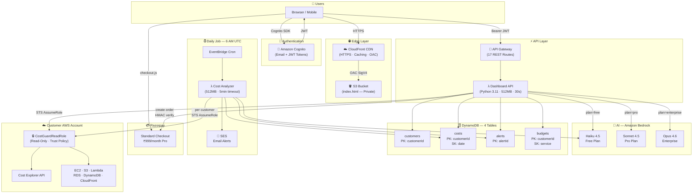

# CostGuard AI — Architecture

## System Architecture Diagram

> This diagram renders interactively on GitHub. View it at: https://github.com/Skferaz/CostGuardAI/blob/main/docs/ARCHITECTURE.md



---

## ASCII Diagram (for terminals / no Mermaid support)

```
┌─────────────────────────────────────────────────────────────────────────┐
│                         CostGuard AI Platform                            │
│                         AWS Account: 717279732828                        │
└──────────────┬──────────────────────────────────┬───────────────────────┘
               │                                  │
   ┌───────────▼──────────┐          ┌────────────▼───────────┐
   │     EDGE LAYER        │          │    DAILY JOB (6AM UTC) │
   │  CloudFront + S3      │          │                        │
   │  (Private bucket,OAC) │          │  EventBridge ──► λ     │
   └───────────┬──────────┘          │  Cost Analyzer          │
               │                     │    │ STS AssumeRole      │
   ┌───────────▼──────────┐          │    ▼                    │
   │      AUTH LAYER       │          │  Customer CE API        │
   │   Amazon Cognito      │          │    │                    │
   │   (JWT tokens)        │          │    ▼                    │
   └───────────┬──────────┘          │  Bedrock Claude         │
               │ Bearer JWT          │    │                    │
   ┌───────────▼──────────┐          │    ▼                    │
   │      API LAYER        │          │  DynamoDB Write         │
   │  API Gateway (17 routes)│         │    │                    │
   │        │              │          │    ▼                    │
   │   λ Dashboard API     │          │  SES Alert Email        │
   └──┬───┬───┬──┬──┬─────┘          └────────────────────────┘
      │   │   │  │  │
      │   │   │  │  └──► Razorpay (HMAC verify → plan upgrade)
      │   │   │  │
      │   │   │  └─────► DynamoDB (4 tables: customers,costs,alerts,budgets)
      │   │   │
      │   │   └────────► Amazon Bedrock
      │   │              ├── Haiku 4.5    (Free plan)
      │   │              ├── Sonnet 4.5   (Pro plan)
      │   │              └── Opus 4.6     (Enterprise)
      │   │
      │   └────────────► STS AssumeRole ──► Customer AWS Account
      │                                     ├── Cost Explorer (billing data)
      │                                     ├── EC2 describe instances
      │                                     ├── S3 list buckets
      │                                     ├── Lambda list functions
      │                                     └── RDS, DynamoDB, CloudFront
      │
      └────────────────► Cognito (validate JWT)
```

---

## Data Flow: Cost Spike Detection

```
6:00 AM UTC
    │
    ▼
EventBridge ──────────────────────────────────────────────► Cost Analyzer λ
                                                                    │
                                                    ┌───────────────┘
                                                    │
                                         Scan customers table
                                                    │
                                    ┌───────────────▼───────────────┐
                                    │  For each customer:            │
                                    │                                │
                                    │  STS AssumeRole               │
                                    │         ▼                      │
                                    │  Cost Explorer GetCostAndUsage │
                                    │  (yesterday + 7-day history)   │
                                    │         ▼                      │
                                    │  % change = (today - avg)/avg  │
                                    │         ▼                      │
                                    │  Bedrock Claude analysis       │
                                    │         ▼                      │
                                    │  Write to costguard-costs      │
                                    │         ▼                      │
                                    │  If change > 20%:              │
                                    │    Write alert to DynamoDB     │
                                    │    Send SES email              │
                                    └────────────────────────────────┘
```

---

## Component Summary

### Lambda Functions

| Function | Memory | Timeout | Trigger | Purpose |
|---|---|---|---|---|
| `costguard-dashboard-api` | 512 MB | 30s | API Gateway | All 17 user-facing routes |
| `costguard-cost-analyzer` | 512 MB | 5 min | EventBridge | Daily cost analysis per customer |

### DynamoDB Tables

| Table | PK | SK | Billing | Purpose |
|---|---|---|---|---|
| `costguard-customers` | customerId | — | PAY_PER_REQUEST | Customer registry |
| `costguard-costs` | customerId | date | PAY_PER_REQUEST | Daily costs + AI analysis |
| `costguard-alerts` | alertId | — | PAY_PER_REQUEST | Spike alerts |
| `costguard-budgets` | customerId | service | PAY_PER_REQUEST | Budget tracking |

All tables: SSE enabled · PITR enabled · DeletionPolicy: Retain

### API Gateway Routes (17 total)

| Group | Routes |
|---|---|
| Core | `/health` `/dashboard` `/alerts` `/cost-summary` |
| AI | `/chat` `/recommendations` `/service-breakdown` |
| Reports | `/report` `/service-detail` |
| Budgets | `/budgets` (GET + POST) |
| Payments | `/create-order` `/verify-payment` `/subscription-status` |
| Admin | `/onboard` `/customers` `/customers/delete` |

### Bedrock Models

| Plan | Model ID | Why |
|---|---|---|
| Free | `us.anthropic.claude-haiku-4-5-20251001-v1:0` | Fast, cheap, good enough for Q&A |
| Pro | `us.anthropic.claude-sonnet-4-5-20250929-v1:0` | Smarter analysis, better recommendations |
| Enterprise | `us.anthropic.claude-opus-4-6-v1` | Maximum reasoning for complex optimization |

> **Note:** `us.` prefix (cross-region inference profile) is required for Claude 4.x. Direct model IDs return `ValidationException: on-demand throughput isn't supported`.

---

## Security Architecture

```
┌──────────────────────────────────────────────────────────┐
│                    Security Layers                        │
│                                                          │
│  1. Edge: CloudFront OAC — S3 bucket fully private       │
│  2. Auth: Cognito JWT — every API call requires token    │
│  3. IAM: Lambda role — least-privilege, scoped to        │
│          specific table ARNs, model ARNs, SES identity   │
│  4. Cross-account: STS AssumeRole — temp creds (1hr)    │
│          trust policy locks to our Lambda role ARN only  │
│  5. Payments: HMAC-SHA256 verify — KEY_SECRET never      │
│          reaches browser, constant-time comparison       │
│  6. Secrets: All creds in Lambda env vars only           │
│          Never in code, never in CloudFormation template │
└──────────────────────────────────────────────────────────┘
```
